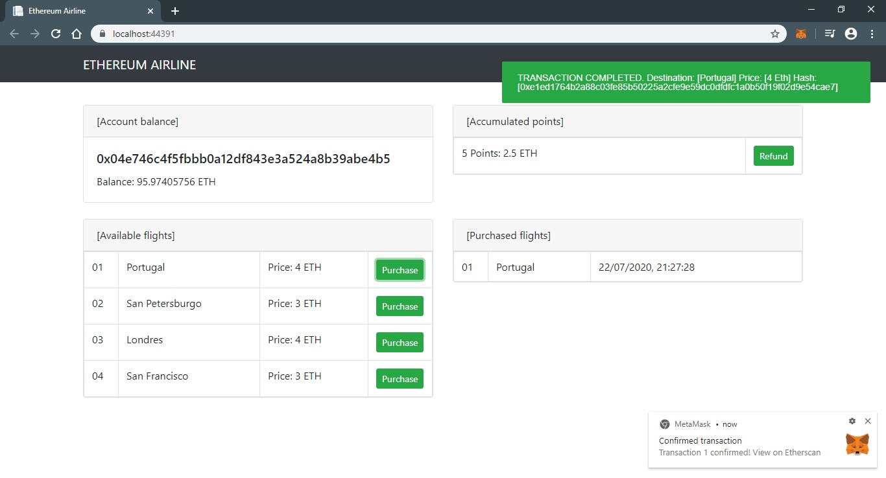

# Ethereum Airline

A simple decentralized application built on Ethereum which allows users to purchase flights and sign transactions with Metamask.

## Screenshots

## Resources

- *[Conviértete en desarrollador Blockchain con Ethereum](https://www.udemy.com/course/conviertete-en-desarrollador-blockchain-con-ethereum/)*
